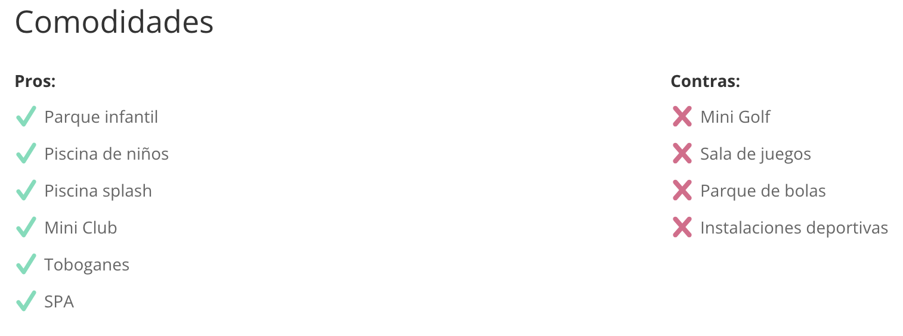

# post-custom-attributes

This module has been create to display various hotel information in different design.

- Title with ACF star field.
- Top niños rating. 
- Title with text attribute (Aconsejado para & Precio ACF field). 
  

 

- All the Boolean ACF fields divided in Pros & cons list with a checkmark or cross SVG. 
  

 

- Button with the Hotel Booking URL. 
  

 

## Main module (`Container.php`)

The Main module is a container that allows one or more attributes element and the ability to add a header as can be seen in this screenshot.

  

The Main module has 3 fields:

- **Elements**: which would have the name of the `attribute` element, more info about the fields in this entry below.
- **Show Header**: toogle the header visibility.
- **Header**: Header text.
  > This field will only show if **Show Header** is set to Yes.

 

## Attributes module (`Attributes.php`)

The Attributes module is designed to show a different dataset in a different design and it has 5 fields, some of them are showing depending on the **Attribute Type** value:

- **Attribute**: a hardcoded list of ACF fields used in the **Attribute Type**.
  > This field is not required, it depends on the **Attribute Type** field you choose.
- **Attribute Text**: the text that will appear in the page in the selected attribute, not all **Attribute Type** have a title though.
- **Attribute Type**: the element design.
- **Rating Color**: the rating color, this will show only if the **Attribute Type** is equal to `Rating`. 
  
- **Button Color**: the button color, this will show only if the **Attribute Type** is equal to `Button`. 
  

## notes

A lot of the text is hard-coded because it was a MVP, so there is space to customize it and make more dynamic. E.g. The rating range, which is out of 10 including the rating value conversion separator from `,` to `.`, list Pros and Contras text included the `get_custom_fields_text` function which there is an exact same copy of it in the **Post Custom Review** module.

The `list` **Attribute Type** groups all the ACF in 2 lists, `true` and `false` values and add either a checkmark or a cross SVG, see [Attribute.php](../wordpress/wp-content/plugins/post-custom-attributes/includes/modules/Attributes/Attributes.php) the `get_custom_fields_text`(line 201) & `get_custom_fields`(line 217) functions.
