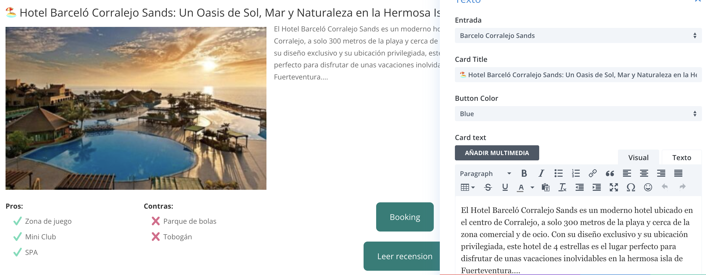

# post-custom-review

This module has been create to write a short hotel review and fetch the hotel information via the ACF fields.

The module have 4 fields:

- **Post**: You can select the post by its name and retrieve its info for the Pros & Contras section, the dropdown will only show published posts.
- **Card Title**: You can give a Title to the Card.
- **Button Color**: A dropdown containing a series of colors, as mentiones in the main [README.md Shared CSS classes](../README.md#shared-css-classes) section, uses some classes coming from the Post Custom Attributes module, this is to keep the code DRY and in sync between the 2 modules. 
- **Card text**: a tiny_mce editor to write a review.

## notes

The **Post** field fetch the following info from the Post:

- The post featured image.
- All the ACF and group them in 2 lists, `true` and `false` values and add either a checkmark or a cross SVG, see [Post.php](../wordpress/wp-content/plugins/post-custom-review/includes/modules/Post/Post.php) the `get_custom_fields_text`(line 72) & `get_custom_fields`(line 88) functions.
- The booking ACF and insert it in the *Booking* button.
- The Post permalink and insert it in the *Leer recension* button.

A lot of the text is hard-coded because it was a MVP, so there is space to customize it and make more dynamic. E.g. Buttons text, list Pros and Contras text included the `get_custom_fields_text` function which there is an exact same copy of it in the **Post Custom Atrributes** module.
